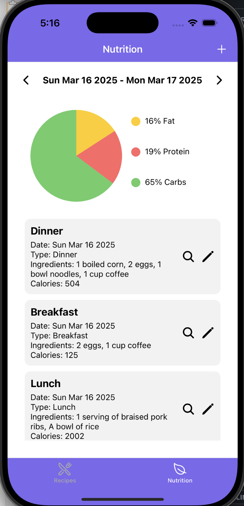
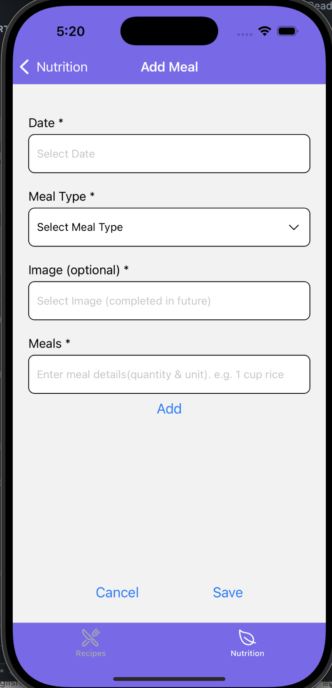
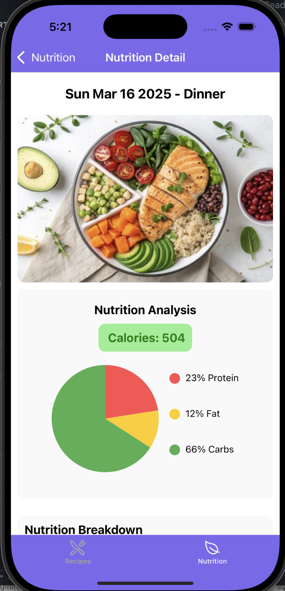
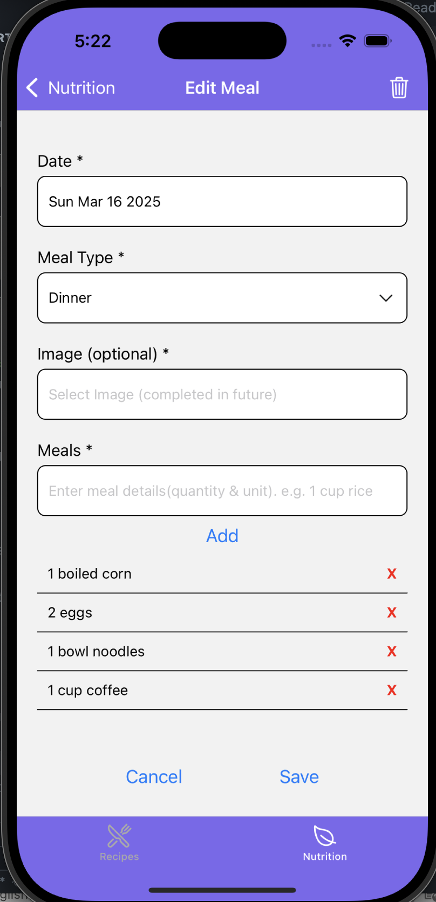

# 🍽️ SmartBite - Iteration Summary

## 1. Data Model & Collections  
We have structured our Firestore database to ensure **efficient data retrieval, scalability, and user-specific data security**.

### **Top-Level Collection:**  
- **`users`** → Each user has their own data.

### **Sub-Collections (under `users/{userId}`):**  
- **`meals`** → Stores meal logs for each user (`{mealId}` document). When a meal is added, its nutrition is automatically analyzed and stored within the meal document. Each document ({mealId}) represents a meal, allowing users to add, edit, and delete meals as needed.
  - ✅ **Create** meals using `writeMealToDB()`.  
  - ✅ **Read** meals and their nutrition using `fetchMeals()`.  
  - ✅ **Update** meals using `updateMealToDB()`.  
  - ✅ **Delete** meals using `deleteMealFromDB()`.  
- **`recipes`** → Stores saved recipes.  

 

📌 **Database structure may change as needed** based on further requirements and optimizations.

---

## 2. Current Application State with Screenshots  

### 🥗 Nutrition Features  

We've implemented the core nutrition tracking functionalities, including:  

1. **Displaying all meals and their nutrition** for a selected date.  
2. **Adding new meals**, with automatic nutrition analysis.  
3. **Viewing detailed nutrition breakdown** for each meal.  
4. **Editing or deleting meals** as needed.  

#### Nutrition Screenshot:  

---

## 3. Team Contributions  
| **Team Member** | **Contributions** |
|----------------|------------------|
| **Yuan Tian** |  **Responsible for the nutrition part.** 1) Designed and optimized the nutrition database structure and queries to efficiently store, retrieve, and update meal nutrition data in Firestore.  2) Developed screen layouts and UI components for nutrition parts, including `AllNutrition.tsx`, `AddMeal.tsx`, `EditMeal.tsx`, and `MealDetail.tsx`.  3) Implemented automatic nutrition analysis using an external API when adding meals, ensuring seamless integration with Firestore. |
| **[Member 2]** | write something. |

---

## 4. Next Steps  
- Integrate **camera functionality** for recipe and meal photo uploads. 
- Implement **notifications** to allow users to schedule reminders. 
- Add **user authentication** to enable secure login and personalized data storage.
- Improve **UI & Styling** for a better user experience.

