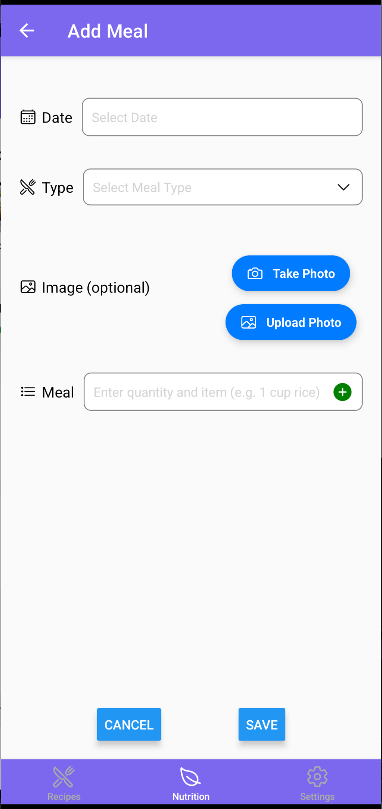
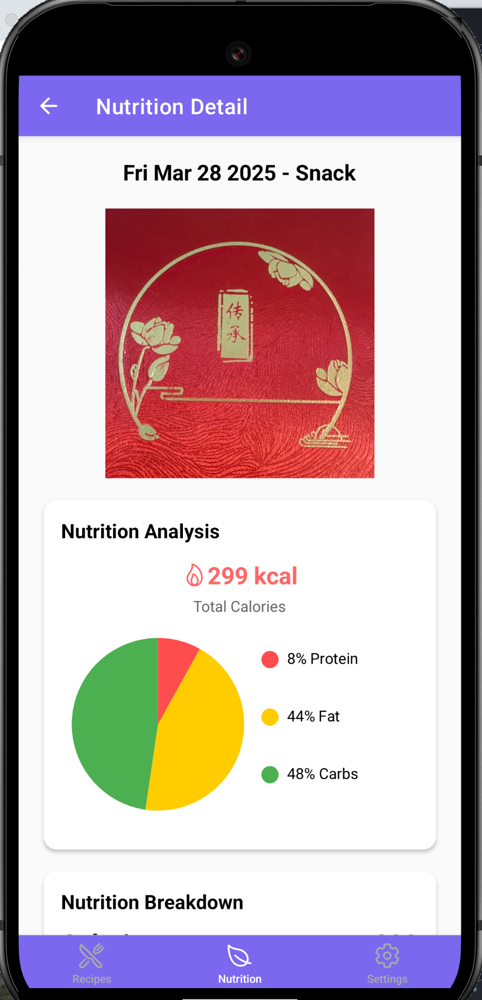
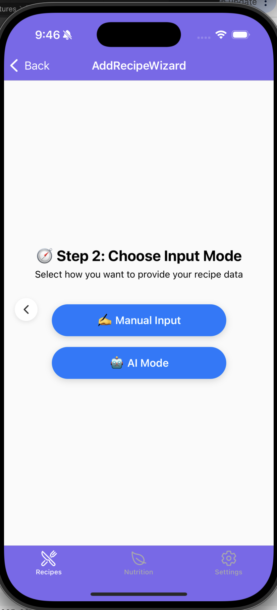
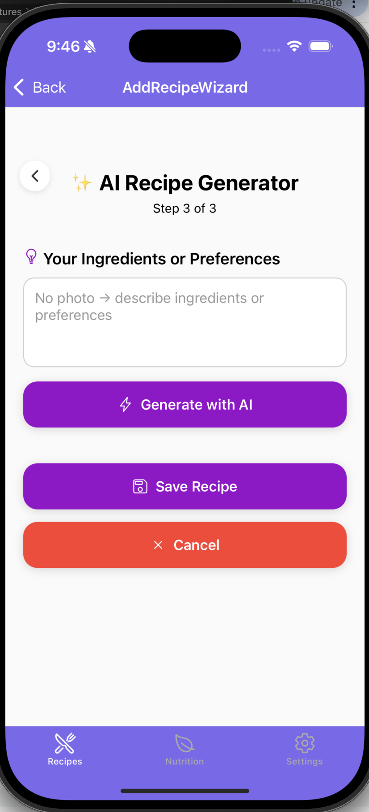
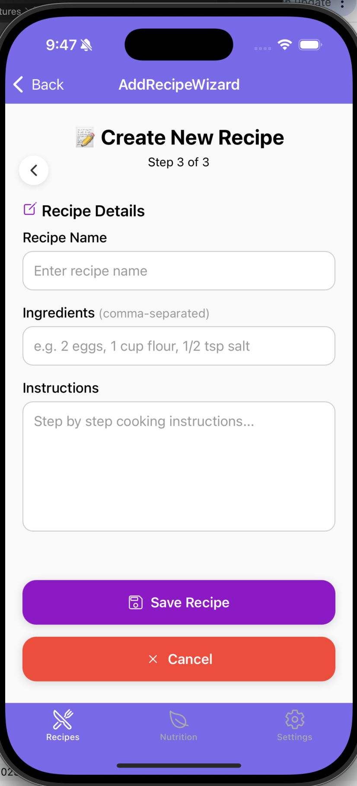
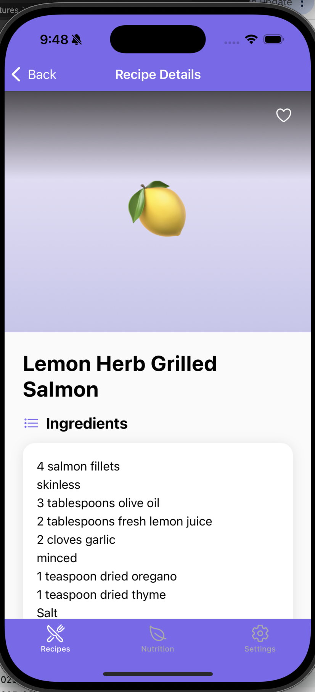
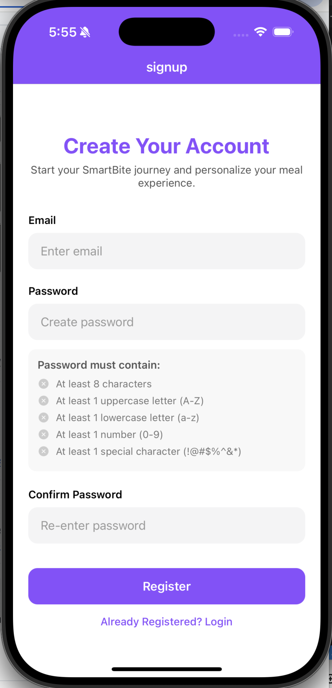

# 🍽️ SmartBite - Iteration Summary

## 1. Data Model & Collections  
We have structured our Firestore database to ensure **efficient data retrieval, scalability, and user-specific data security**.

### **Top-Level Collection:**  
- **`users`** → Each user has their own data.
- Contains two sub-collections:
  - meals
  - recipes
- Currently, the user document itself is empty, but we plan to add fields in the future (e.g., profile preferences, avatar, signup date).

### **Sub-Collections (under `users/{userId}`):**  
- **`meals`** → Stores meal logs for each user (`{mealId}` document). When a meal is added, its nutrition is automatically analyzed 
and stored within the meal document. Each document ({mealId}) represents a meal, allowing users to add, edit, and delete meals as needed.

  ```
  meals Schema
  {
    id: string;
    date: Timestamp;
    type: string;            // type of the meal (e.g., "Breakfast")
    image?: string;
    ingredients: string[];
    analyzed: boolean;
    nutrition?: Nutrition;
  }

  ```
  - ✅ **Create** meals using `writeMealToDB()`.  
  - ✅ **Read** meals and their nutrition using `fetchMeals()`.  
  - ✅ **Update** meals using `updateMealToDB()`.  
  - ✅ **Delete** meals using `deleteMealFromDB()`.  
- **`recipes`** → Stores saved recipes for each user (`{recipeId}` document).  
Users can create, edit, delete, and mark recipes as favorite. Each document (`{recipeId}`) represents an individual recipe, containing ingredients, instructions, and timestamps.
  ```
  recipes Schema
  {
  id?: string;
  name: string;
  ingredients: string[];
  instructions: string;
  photoUrl?: string;
  createdAt?: any;
  isFavorite?: boolean;
}

  ```

  - ✅ **Create** recipes using `addRecipe()`, profile using `saveUserProfile()`.
  - ✅ **Read** recipes using `getAllRecipes()` or `getRecipeById()`, profile using `getUserProfile()`.
  - ✅ **Update** recipes using `updateRecipe()`, profile using `updateUserProfile`.
  - ✅ **Delete** recipes using `deleteRecipe()` or `deleteAllRecipes()`.

 

📌 **Database structure may change as needed** based on further requirements and optimizations.

---


## 2. Current Application State with Screenshots  

### 🥗 Nutrition Features  

We've implemented the core nutrition tracking functionalities, including:  

1. **Displaying all meals and their nutrition** for a selected date.  
2. **Adding new meals**, with automatic nutrition analysis.  
3. **Viewing detailed nutrition breakdown** for each meal.  
4. **Editing or deleting meals** as needed.  
5. **Uploading meal images** using the device camera, with image storage integrated via Firebase Storage.


#### Nutrition Screenshot:  







#### Recipe Screenshot:  








#### Settings Screenshot:


#### Profile Screenshot:


#### Login/Register/Forgot/Password_Strength Screenshot:




#### Welcome Screenshot:


---

## 3. Team Contributions  
| **Team Member** | **Contributions** |
|----------------|------------------|
| **Yuan Tian** |  **Responsible for the nutrition part.** 1) Designed and optimized the nutrition database structure and queries to efficiently store, retrieve, and update meal nutrition data in Firestore.  2) Developed screen layouts and UI components for nutrition parts, including `AllNutrition.tsx`, `AddMeal.tsx`, `EditMeal.tsx`, and `MealDetail.tsx`.  3) Implemented automatic nutrition analysis using an external API when adding meals, ensuring seamless integration with Firestore. 4) Implemented image upload functionality for meals using Firebase Storage. |
| **Yue Wang** | 1) Designed and structured the **recipe database** in Firestore to efficiently manage user-created recipes, ensuring seamless CRUD operations.  
2) Developed screen layouts and UI components for the recipe sections, including `index.tsx`(all recipe screen), `[id].tsx`(recipe detail screen), `Add.tsx`(add recipe screen), and `Edit.tsx`(edit recipe screen).  
3) Implemented **favorite functionality**, allowing users to mark and unmark recipes as favorite, storing this preference in Firestore for persistence, and allowing display filters to conditionally render recipe cards in the screen.
4) Applied theme changing functionality throughout the entire application. 
5) Ensured data consistency by aligning the recipe structure with the meal storage model, keeping Firestore operations efficient and unified. 
6) Created **profile** portal in settings screen, allowing users to click area and navigate to profile screen, in `app/(protected)/(others)/profile.tsx`; allowing sign out functionality in settings page, `app/(protected)/(others)/index.tsx`; allowing users to take or upload a photo as their profile avatar and make their own nickname on profile, making sure the data consistency with firesbase database; 
7) Partially implemented **authentication** login/register/forgot password screens and functionalities in `app/(auth)`, user can now have their real time individual data that can be stored on firebase and retrirvable relating to their account, also they will be asked to input strong password through `utils/validatePassword` to make sure strong password, they will also receive password reset link from their email to reset. 
8) Achieved two **external AI apis** to work as a pipeline for generated texts, using google cloud vision api to recognized from photo,`utils/googleVision`, then combine preference input to be a comprehensive prompt to OPENAI api, model: gpt-4o-mini to generate recipes,`utils/generateRecipeWithAI`. The comprehensive logic is in `app/(protected)/(recipes)/AddRecipeWizard/Step3EditConfirm`. 
9) Applied a partial done **Welcome** page for users that are not registered or not logged in to browse limited contents.   !!!Note the APIs I was using are all paid usage, if you just want to see the workflow, please degrade my model selection from gpt4o to something free.


---

## 4. Next Steps  
- Integrate **camera functionality** for recipe photo uploads. - Done
- Implement **notifications** to allow users to schedule reminders. 
- Add **user authentication** to enable secure login and personalized data storage. - Done
- Improve **UI & Styling** for a better user experience.
- Acheieve **location** for grocery store recommendations.
- Possible **Daily recipe threads** for anounumous uses to browse.